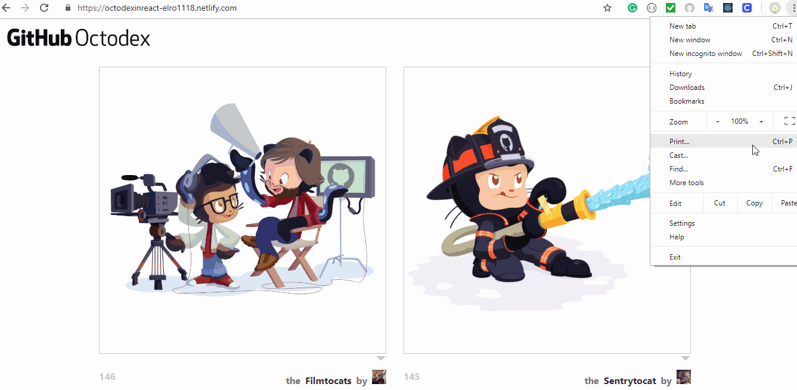
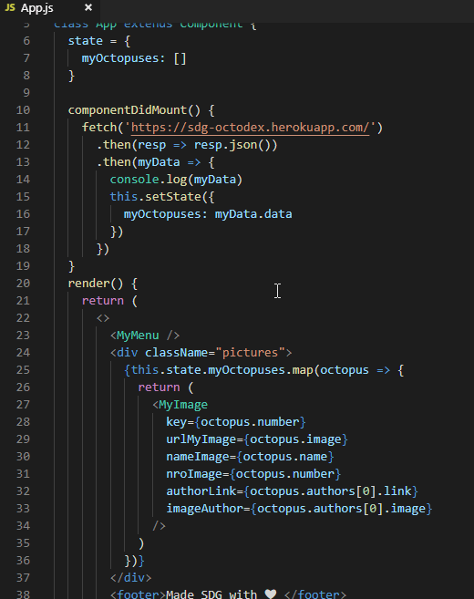

# Octodex in React

My goal was to create a web page that displayed the GitHub mascot which calls OctoCat from GitHub using:
<a href="https://developer.mozilla.org/en-US/docs/Web/Guide/HTML/HTML5">Html, </a>
<a href="https://developer.mozilla.org/en-US/docs/Web/CSS">CSS, </a>
<a href="https://reactjs.org/">React, </a>
<a href="https://en.wikipedia.org/wiki/Application_programming_interface">API and </a>
<a href="https://code.visualstudio.com/">VS Code</a>

</img>

I am proud of this project because I learned to create an application with React and API at the same time to reinforce my knowledge in Html, CSS, Javascript, and web Responsive  using VS Code as a tool.

</img>
